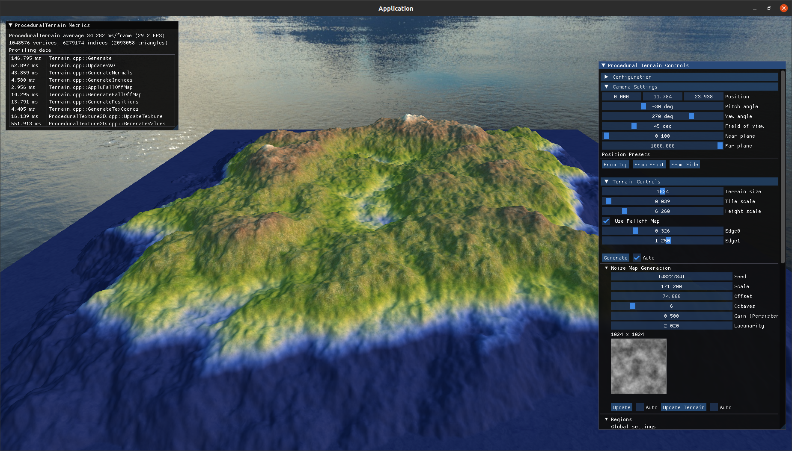
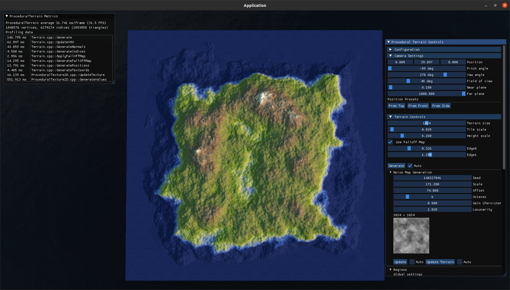
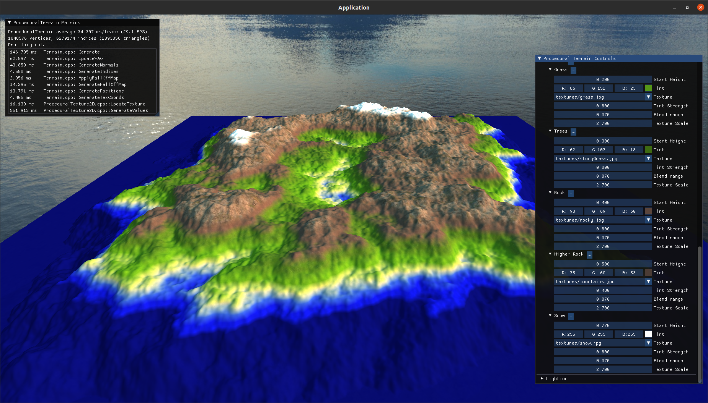
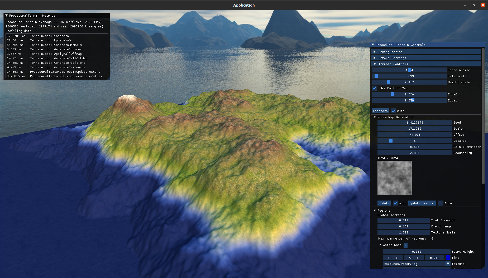
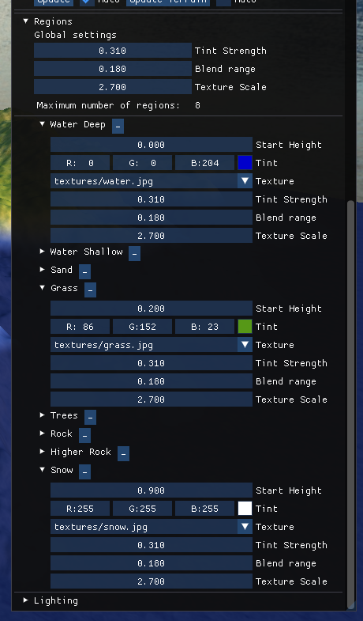

# OpenGL Procedural Terrain Generator

Simple procedural terrain generator written in C++ using OpenGL. The application generates a grid of vertices of certain size that are displaced by procedurally generated height map of accumulated Perlin noise values.

|   |   |
|---|---|
|||
|||

## Features
Version 1.1
* Height-based terrain - grid of displaced vertices
* Procedural height map - Fractal noise of Perlin noise
* Cube map - sky box arround the terrain
* FPS camera - allows to fly-over the terrain
* Shading based on Phong shading model, along with height-based blending
    * blending between height regions that are textured and / or single colored
* Interactive GUI - set various terrain parameters, add / remove regions
* Falloff map - allows generation of islands
* Profiling - visualizes execution time of certain functions

Regions config window:

### Planned
* Optimization: CPU parallelization, GPU off-load
* LOD
* Physically-based shading
* Water
* Atmospheric model
* Save to a file, load from a file

## How to compile
Tested on Ubuntu 20.04, using GCC 9.4.0 x86-64.

### Requirements:
* C++17 complier
* min. CMake 3.16
* min. OpenGL 4.5 compatible GPU

In root directory of this project:
* mkdir build && cd build
* cmake ..
* make
* ./terrain

## Used libraries
* [SGL](https://github.com/kentril0/SimpleGraphicsLibrary) - custom simple graphics library

## Release notes

* Version 1.1:
    - refactored, implemented using custom SGL library

* Version 1.0:
    - Interactive GUI for tweaking your terrain
    - FPS camera
    - Skybox
    - Procedural Mesh
    - Accumulated Perlin Noise
    - Texturing
    - Falloff map
    - Height-based Blending
    - Shading using Phong model